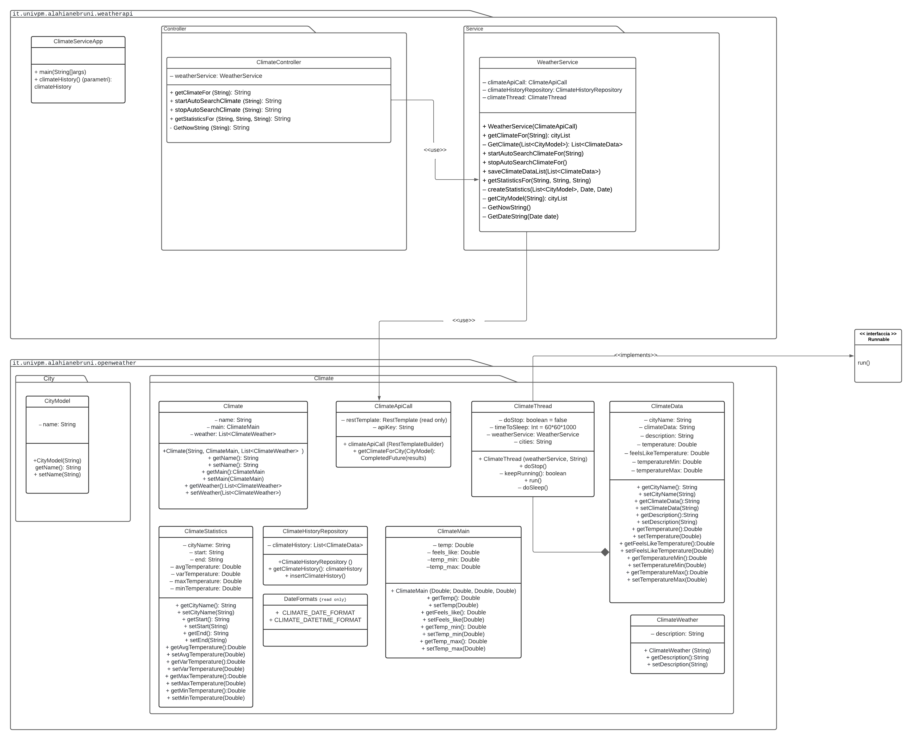
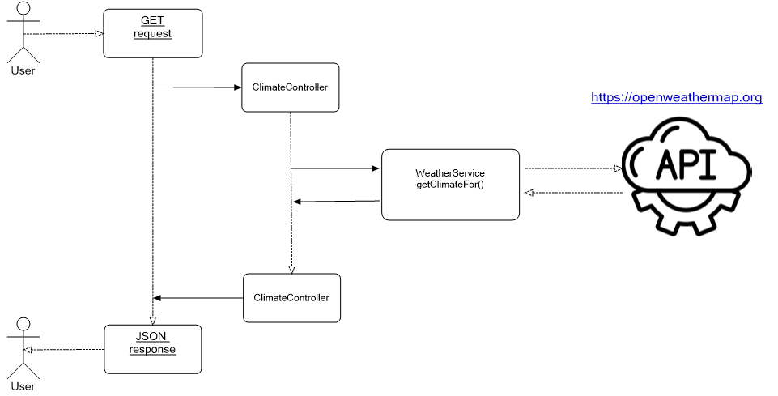
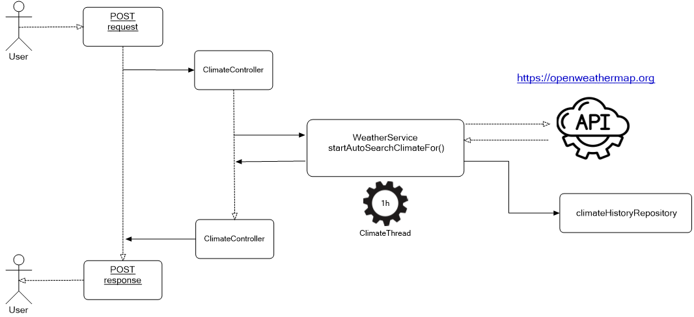
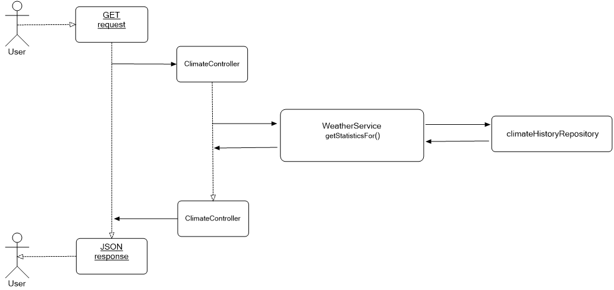

<h1 align="center"> <font size="6">ClimateService</font> </h1>


<p align="center">
L'applicazione ClimateService permette di visualizzare i principali dati meteorologici di una o più città, generare e visualizzare le statistiche.
</p>

## **Contenuti**
1. [Introduzione](#introduzione)
2. [Installazione](#installazione)
3. [Configurazione](#configurazione)
4. [Diagrammi Uml](#diagrammi-uml)
5. [Rotte](#rotte)
6. [Autori](#autori)


##Introduzione


**ClimateService**, attraverso delle chiamate all’API del servizio on-line [www.openweathermap.org](https://openweathermap.org/), permette di visualizzare i dati meteorologici come le temperature massima e minima, la temperatura percepita ed una descrizione generale del tempo. Una volta fatta una specifica chiamata POST (che vedremo in dettaglio nella sezione Rotte) dal cliente (es.Postman), l'applicazione iniziarà a raccogliere i dati sulla/sulle città d'interesse. Successivamente si potrà richiedere le statistiche con la possibilità di personalizzare l'arco temporaneo su cui verrano eseguiti i calcoli statistici. <br/>
Effettuando le chiamate all'API per "nome della città" non abbiamo nessun vincolo per quanto riguarda il numero delle città disponibili, tuttavia le città scelte devono essere supportati dal servizio [www.openweathermap.org](https://openweathermap.org/). 


##Installazione
 ClimateService è installabile dalla riga di comando digitando:  
 
```
git clone https://github.com/sofia-alahiane/progetto2022
```


#Configurazione
Per il corretto funzionamento dell'applicazione ClimateService Vi chiediamo di impostare alcuni parametri nel file src/main/resources/application.properties :

<font size="5">server.port</font>

+ indica la porta su cui sta operando la nostra app, impostata di default sul valore **8081**.

<font size="5">openweatherApiKey</font>

- rappresenta la API Key fornita da [www.openweathermap.org](https://openweathermap.org/). Per ottenere la chiave bisogna iscriversi sul sito [www.openweathermap.org](https://openweathermap.org/). Abbiamo provveduto ad inserire una chiave provvisoria per permmetterVi di testare l'applicazione. 


#Diagrammi UML
Classes Diagram



#Rotte
Nella tabella sottostante abbiamo elencato tutti gli URL di accesso alla nostra app:

| Metodo | Indirizzo |
|--------|--------|
| ` GET ` | `http://localhost:8081/climate?cities=Bari, Milano`| 
| ` POST ` | `http://localhost:8081/climate/search/start?cities=Kiev` |
| ` POST ` | `http://localhost:8081/climate/search/stop` | 
| ` GET ` | `http://localhost:8081/climate/statistics?cities=Ancona` | 

<!-- blank line -->
<!-- blank line -->

Vediamo in dettaglio come funziona ognuna di esse: 

<!-- blank line -->
<!-- blank line -->

| ` GET ` | `http://localhost:8081/climate?cities=Kiev`|

**Parametri**

- cities: Nome di una o più citta separati dalla virgola. 

Restituisce i dati meteorologici in tempo reale delle città passate in Query String. <br/>
Ecco l'esempio del JSONArray di risposta:

```
{
        "cityName": "Kiev",
        "climateDate": "2022/02/24 18:13:00",
        "description": "cielo coperto",
        "temperature": 4.05,
        "feelsLikeTemperature": 4.05,
        "temperatureMin": 3.14,
        "temperatureMax": 4.29
    }
```


<!-- blank line -->
<!-- blank line -->

| ` POST ` | `http://localhost:8081/climate/search/start?cities=Ancona` |

**Parametri**

- cities: Nome di una o più citta separati dalla virgola. 

Fa partire il caricamento dei dati meteorologici facendo delle chiamate all'API ogni ora.<br/>
In risposta otteniamo : `Start searching...`

<!-- blank line -->
<!-- blank line -->
<!-- blank line -->



<!-- blank line -->
<!-- blank line -->
<!-- blank line -->

| ` POST ` | `http://localhost:8081/climate/search/stop` | 

- Ferma il caricamento dei dati. <br/>
In risposta otteniamo : `Stop searching...`

<!-- blank line -->
<!-- blank line -->

[4]| ` GET ` | `http://localhost:8081/climate/statistics?cities=Ancona` | 

**Parametri**

- cities: Nome di una o più citta separati dalla virgola. 

<!-- blank line -->

<br/>E' possibile inserire altre due variabili opzionali nella Query String:<br/>

- start: è la data d’inizio dell'arco temporale per la statistica (formato yyyy/MM/dd HH:mm:ss)
- end:  è la data di fine dell'arco temporale per la statistica (formato yyyy/MM/dd HH:mm:ss)

Se i parametri opzionali non vengono inseriti il lasso di tempo di default va da 00:00:00 a 23:59:59 del giorno corrente.<br/>

L'esempio completo: `http://localhost:8081/climate/statistics?cities=Ancona&start=DataInizio&end=DataFine` <br/>

Questa rotta recupera i dati statistici come temperatura media, massima e minima e la varianza per l'arco temporale scelto. <br/>

Ecco l'esempio del JSONArray di risposta:


```
 {
        "cityName": "Ancona",
        "start": "2022/02/24 00:00:00",
        "end": "2022/02/24 23:59:59",
        "avgTemperature": 10.37,
        "varTemperature": 3.959999999999999,
        "maxTemperature": 13.04,
        "minTemperature": 9.08
    }
```


<!-- blank line -->
<!-- blank line -->

# Autori
Progetto realizzato da:
- Sofiya Alahiane (50%)
- Daniele Bruni (50%)


